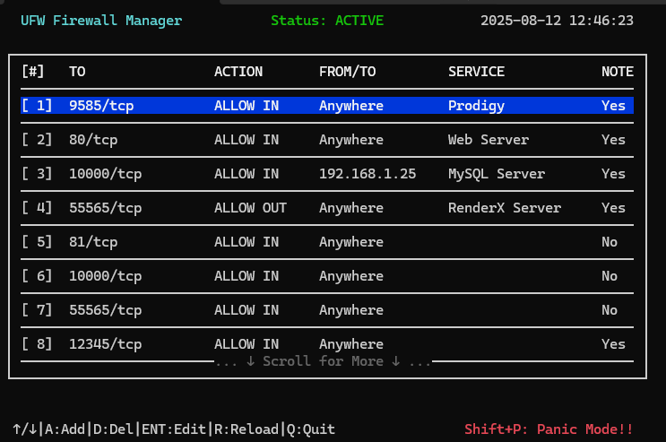
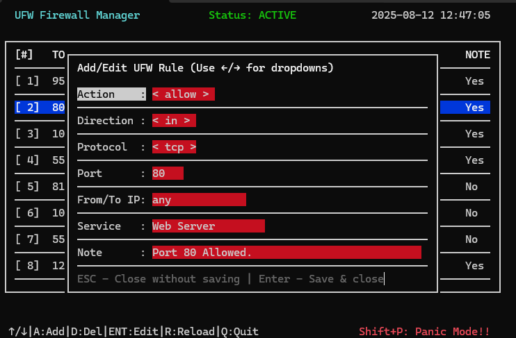
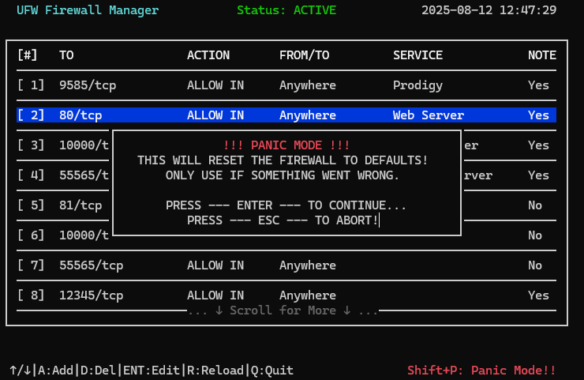

# 🔥 UFW Manager TUI

**UFW Manager** is an interactive **Terminal User Interface** (TUI) for managing [UFW (Uncomplicated Firewall)](https://wiki.ubuntu.com/UncomplicatedFirewall) on Linux.  
It provides a **full-screen, curses-based interface** to view, add, edit, and delete firewall rules, with extra features for **service tagging**, **notes**, and a **panic mode** for emergency resets.

---

## Screenshots!
 - **Main Interface:**


 - **Rule Editing:**


 - **!! PANIC MODE !!**


## ✨ Features

- **Live UFW status** display (active/inactive/error)
- **Scrollable, interactive rule list** with highlighting
- **Add / Edit rules** with dropdown menus and text fields
- **Attach custom service names and notes** to firewall rules
- **Delete rules** with confirmation and auto-reindexing of notes/services
- **Reload UFW** directly from the interface
- **Panic Mode** — instantly reset firewall to defaults
- **Persistent storage** for notes and service names in `~/.config/ufwnotes`
- **Keyboard-driven navigation** with minimal mouse dependence

---

## 📦 Requirements

- Python 3.7+
- `ufw` installed and configured on your system
- Sudo privileges (required for modifying firewall rules)
- Linux terminal with at least **80 (columns) x 24 (rows)** resolution - Yes, because actual terminals are still a thing! ;)

Install UFW if not present:
```bash
sudo apt update && sudo apt install ufw
````

---

## 🚀 Installation & Running

Clone this repository:

```bash
git clone https://github.com/YOUR_USERNAME/ufw-manager-tui.git
cd ufw-manager-tui
```

Run:

```bash
python3 ufwmanager.py
```

> **Note:** You’ll need to run in a terminal capable of curses-based apps, preferably in full-screen mode.

---

## 🖥 Interface Overview

The application has **three main sections**:

1. **Header**

   * Displays current **time**, **UFW status** (Active/Inactive/Error), and app title.

2. **Main Window**

   * Lists firewall rules with columns:

     * **\[#]** — Rule number
     * **TO** — Target of the rule
     * **ACTION** — Allow, Deny, Reject, or Limit
     * **FROM/TO** — Source or destination IP
     * **SERVICE** — Custom label you assign
     * **NOTE** — "Yes" if a note is attached, otherwise "No"

3. **Footer**

   * Shows available **keyboard shortcuts**
   * Displays **status messages** from actions

---

## 🎮 Keyboard Shortcuts

| Key / Combo | Action                                   |
| ----------- | ---------------------------------------- |
| **↑ / ↓**   | Move selection up/down in rule list      |
| **A**       | Add a new firewall rule                  |
| **Enter**   | Edit the currently selected rule         |
| **D**       | Delete selected rule (with confirmation) |
| **R**       | Reload UFW firewall                      |
| **Shift+P** | Panic Mode (reset firewall to defaults)  |
| **Q**       | Quit the application                     |

---

## 📝 Adding & Editing Rules

When adding or editing a rule, you’ll see a **form** with the following fields:

1. **Action** — `allow`, `deny`, `reject`, `limit`
2. **Direction** — `in` or `out`
3. **Protocol** — `tcp`, `udp`, or `any`
4. **Port** — Numeric port value (required)
5. **From/To IP** — IP address or `any`
6. **Service** — Optional service label (stored persistently)
7. **Note** — Optional note for the rule (stored persistently)

Navigation inside the form:

* **Tab / ↓** — Move to next field
* **Shift+Tab / ↑** — Move to previous field
* **← / →** — Change dropdown values (Action, Direction, Protocol)
* **Enter** — Save rule
* **Esc** — Cancel without saving

---

## ⚠ Panic Mode

**Shift+P** triggers **Panic Mode**, which:

* Prompts you for confirmation
* Runs `sudo ufw reset` to restore UFW to its default state
* Removes all custom rules and resets notes/services

> Use only if something has gone very wrong with your firewall setup.

---

## 📂 Notes & Services Storage

Custom service names and notes are stored in:

```
~/.config/ufwnotes/services.txt
~/.config/ufwnotes/notes.txt
```

* These are **persisted** between sessions
* Automatically reindexed if rules are deleted

---

## 🛠 Troubleshooting

* **UFW not found** — Make sure UFW is installed (`sudo apt install ufw`)
* **Permission denied** — You need sudo rights to modify firewall rules
* **Terminal too small** — Resize terminal to at least 80x15

---

## 📜 License

This project is licensed under the MIT License — see the [LICENSE](LICENSE) file for details.

---

If you’d like, I can also create a **preview screenshot** of your TUI layout (mocked with fake rules) so your GitHub README will look more attractive and help users understand the interface instantly. That would make it look more polished.
```
